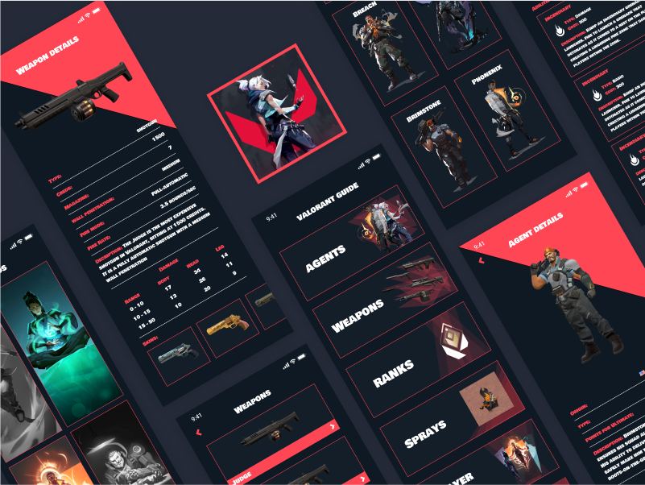

# Valorant Guide 
✨ Mini Project Mobile Engineer with Flutter ✨
Organized by Altera Academy - Independent Campus Batch 6

# About Valorant Guide 
🔫 Valorant Guide: Panduan Terbaik untuk Meningkatkan Skill Bermain! 🔫

Valorant Guide adalah aplikasi panduan yang dirancang khusus untuk membantu pemain game Valorant mencapai potensi maksimal mereka. Dengan aplikasi ini, Anda akan mendapatkan:

📚 Informasi Mendalam: Pelajari semua tentang agen, senjata, dan peta yang ada di game Valorant.
🎯 Strategi dan Tips: Pahami peran dan strategi terbaik untuk setiap agen dan senjata di berbagai peta.
🛡️ Peningkatan Kemampuan: Temukan gaya bermain yang paling cocok untuk Anda dan kuasai permainan dengan lebih baik.
🌐 Fitur Lengkap: Nikmati fitur-fitur tambahan yang akan membuat Anda menjadi pemain yang lebih unggul di setiap pertandingan.

Jadilah pemain terbaik di tim Anda dan dominasi setiap pertandingan dengan Valorant Guide!

# Valorant Guide Feature
🔍 Fitur Unggulan di Aplikasi Valorant Guide: 🔍

🌟 Eksplorasi Lengkap: Temukan daftar lengkap agen, peta, senjata, dan peringkat yang tersedia.
📖 Informasi Mendalam: Dapatkan detail rinci tentang setiap agen, peta, dan senjata untuk meningkatkan strategi permainan Anda.
🔎 Pencarian Cepat: Cari dengan mudah semua informasi yang Anda butuhkan hanya dalam beberapa klik.
🔐 Akses Aman: Login dan daftar dengan mudah untuk pengalaman yang dipersonalisasi.
🤖 Analisis Cerdas: Manfaatkan analisis gameplay berbasis AI untuk mengasah kemampuan dan strategi Anda.

